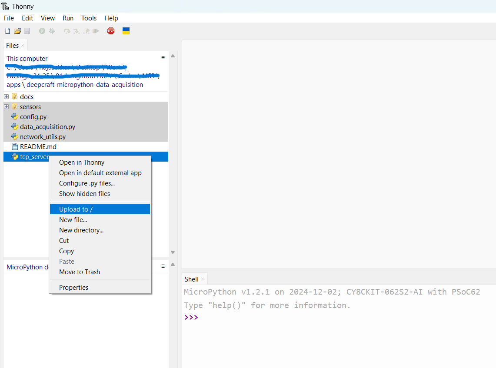
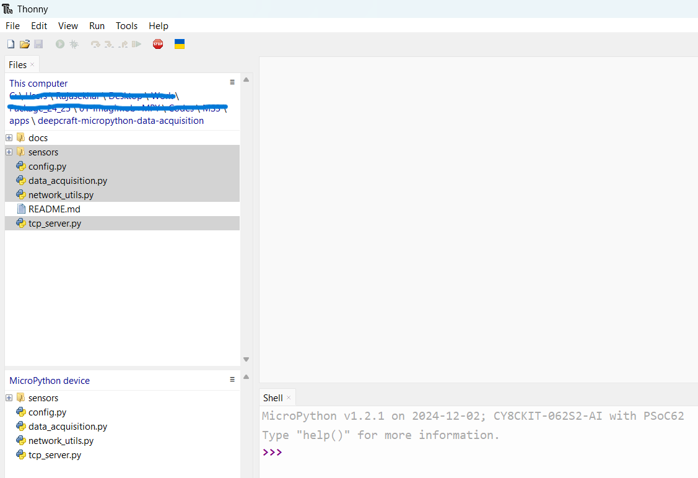
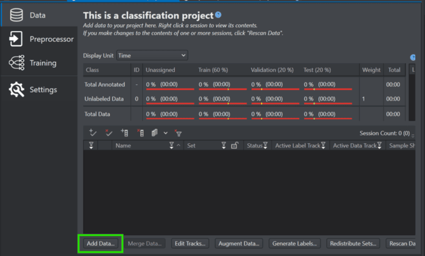
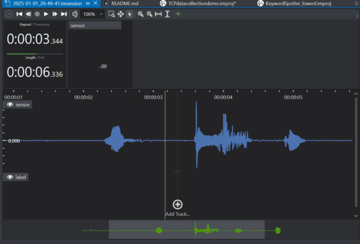

# DEEPCRAFT™ Studio Data Acquisition using MicroPython

This repository offers a comprehensive framework for streaming sensor data, such as audio from PDM microphones, over WiFi using MicroPython. The captured data can be seamlessly integrated into [DEEPCRAFT™ Studio](https://www.imagimob.com/studio) for further processing, labeling, and model training.

## Supported Boards

- CY8CKIT-062S2-AI

## Pre-requisites
1. A PSOC™ 6-based device with MicroPython firmware installed. Refer to our [installation guide](https://ifx-micropython.readthedocs.io/en/latest/psoc6/installation.html) for detailed instructions.

2. Clone and set up the Capture Server repository by following the instructions provided in the [Capture Server documentation](https://bitbucket.org/imagimob/captureserver/src/master/).

3. Clone this repository:
    ```bash
    git clone https://github.com/Infineon/deepcraft-micropython-data-acquisition.git
    ```
4. Install [DEEPCRAFT™ Studio](https://softwaretools.infineon.com/tools/com.ifx.tb.tool.deepcraftstudio) 

## Usage
1. Open the cloned repository in a MicroPython-supported IDE, such as [Thonny](https://thonny.org/), and update the `config.py` file with your WiFi credentials:
    
    ```bash
    SSID = "your wifi name"
    PASSWORD = "your wifi password"
    ```
2. Transfer all source files to the device by right-clicking on the project folder and selecting "Upload to /".

    

    After completing the upload, all the source files will be visible in the filesystem of your MicroPython edge device.

    

2. Open a command prompt, navigate to the root directory of the cloned Capture Server repository, and then change to the `examples/generic` folder:
    
    ```bash
    cd examples/generic
    ```

3. Execute the following command, ensuring you replace the placeholders with the appropriate values for your setup:
    
    ```bash
    python generic_local_capture_interface.py --output-dir "Your output directory" --protocol TCP --ip-address "Your board's IP address" --port 5000  --data-format ".data or .wav" --data-type h --samples-per-packet 512 --features 1 --sample-rate 16000 --video-disabled.
    ```
    For explanation on each of the parameters, please check the [Capture Server documentation](https://bitbucket.org/imagimob/captureserver/src/master/).

    The recorded data will be stored in the output directory mentioned above.

4. Launch DEEPCRAFT™ Studio and create a new project or open an existing one. Go to the DATA tab, click on the *Add Data* button, and choose the output directory containing the captured `.wav` or `.data` files along with their corresponding label files.

    

5. After selecting the output directory, DEEPCRAFT™ Studio will automatically import the audio/data files and their corresponding label files into a new data session.

    

6. After creating the data session, your dataset will be accessible within DEEPCRAFT™ Studio, ready for preprocessing, labeling, and training machine learning models. 🚀

    

## Add your own Sensor
Want to stream data from a different sensor? The integration is straight forward — just implement a few standard methods in your sensor driver to work seamlessly with the capture script.

### Sensor Driver Interface
Every sensor must have its own sensor driver file (e.g. `pdm_pcm.py`) which must define the following methods: 

| Method                 | Description                                                                 | Input Args                  | Return Type                 |
|------------------------|-----------------------------------------------------------------------------|-----------------------------|-----------------------------|
| `__init__()`           | Set the default parameters for the sensor.                                  | `self`                      | `None`                      |
| `init()`               | Initialize the sensor hardware (e.g. I2C or SPI setup).                     | `self`                      | `None`                      |
| `get_buffer()`         | Return the internal buffer used to store captured sensor samples.           | `self`                      | `List[int]` / `List[float]` |
| `get_format()`         | Specify how data should be packed for the transmission.                     | `self`                      | `Tuple[str, str]`           |
| `read_samples(buffer)` | Capture data into the provided buffer in-place.                             | `self`, `buffer: List`      | `None`                      |
| `deinit()`             | Power down the sensor and release any used resources.                       | `self`                      | `None`                      |


With the interface defined, just import your new sensor in the `data_acquisition.py` script and define your sensor config in the `main` block. 
1. For PDM microphones, we configure it as:

```python
config = {
    "clk_pin": "P10_4",
    "data_pin": "P10_5",
    "sample_rate": 16000,
    "gain": 20,
    "buffer_size": 512,
    }
```
2. For BMI270 sensor with interrupt, we configure it as:

```python
int_pin = Pin("P1_5", mode=Pin.IN, pull = Pin.PULL_DOWN)
int_pin.irq(handler=cback, trigger=Pin.IRQ_FALLING)

config = {
    "bus": i2c,
    "accel_range": b.ACCEL_RANGE_2G,
    "gyro_range": b.GYRO_RANGE_250,
    "interrupt_config": int_pin
    }
```
If interrupt functionality is not desired, pass None.

## FAQs

Q: I am encountering an error when trying to run the capture server, with messages such as __"Device not found or another error occurred: [WinError 10054] An existing connection was forcibly closed by the remote host."__

A: This error typically occurs when the client and server are not properly synchronized, and the client is already sending data before the server is ready to receive it. The current implementation uses a time.sleep(0.1) delay to account for this synchronization, which should cover most cases. However, if the delay is too short or too long for your specific sensor implementation, you may need to adjust this value accordingly.

Important Considerations:

- When adjusting the delay value, keep in mind that print statements in the script can also introduce a small delay, which should be factored into your calculation.
- Ensure that the delay value is set to a suitable duration to allow for proper synchronization between the client and server.


Q: I am experiencing __duplicate timestamps__ when importing data to Studio.

A: Duplicate timestamps may occur when importing data to Studio if the sensor is changed without adjusting the delay value accordingly. To resolve this issue, ensure that the delay value in `data_acquisition.py` script is adjusted in accordance with your implementation to synchronize the server and client. This adjustment will prevent duplicate timestamps and ensure accurate data importation.

## Contributing Guide
Please do not hesitate to share your sensor integration with the community! Open a [Pull Request](https://github.com/Infineon/deepcraft-micropython-data-acquisition/pulls) with your `sensors/sensor_name.py` and an example configuration in the `README.md`. 🙌