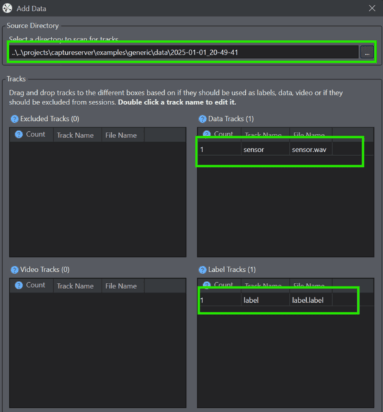

# DEEPCRAFT™ Micropython Data Acquisition

This repository provides a framework to stream sensor data like audio from PDM microphones over WiFi using MicroPython to DEEPCRAFT™ studio.

## Tested Boards:

- CY8CKIT-062S2-AI

## Pre-requisites
1. PSoC6 based device flashed with MicroPython firmware. Check the [mpy-psoc6.py utility](https://ifx-micropython.readthedocs.io/en/latest/psoc6/installation.html) to do so.

2. Clone and setup the captureserver repo by following instructions given [here](https://bitbucket.org/imagimob/captureserver/src/master/)

3. Clone this repository:
    ```bash
    git clone https://github.com/Infineon/deepcraft-micropython-data-acquisition.git
    ```
4. [DEEPCRAFT™ Studio](https://softwaretools.infineon.com/tools/com.ifx.tb.tool.deepcraftstudio) 

## Usage
1. Open this cloned repo in micropython supported IDE's like thonny and update in config.py with your wifi credentials:
    
    ```bash
    SSID = "your wifi name"
    PASSWORD = "your wifi password"
    ```
2. Copy the complete sources to device by right clicking and selecting Upload to /

    

    Once done, you will see all the sources in your micropython edge device filesystem

    

2. Open a cmd prompt from root of capture server cloned repo and navigate to examples/generic:
    
    ```bash
    cd examples/generic
    ```

3. Run the below command after updating the values according to your setup:
    
    ```bash
    python generic_local_capture_interface.py --output-dir "mention the output dir" --protocol TCP --ip-address "Board IP address" --port 5000  --data-format ".data or .wav" --data-type h --samples-per-packet 512 --features 1 --sample-rate 16000 --video-disabled.
    ```
    For explanation on each parameters, please check the [capture-server documentation](https://bitbucket.org/imagimob/captureserver/src/master/).

    The recorded data will be stored in the output directory mentioned.

4. Open Deepcraft Studio and either create a new project or open an existing one. Navigate to the DATA tab and click the Add Data button. Select the output directory where the captured .wav or .data and associated label files were saved.

    

5. Upon selection, the studio will automatically detect and load the audio/data and label files into a new data session.

    

6. Once the data session is created, your dataset is now available inside the studio and ready for preprocessing, labeling, and model training.

    
